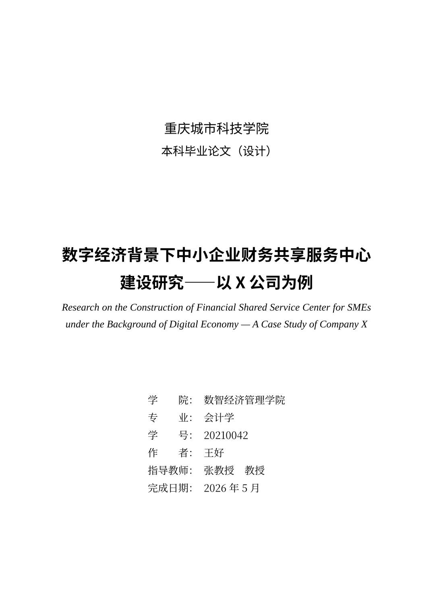
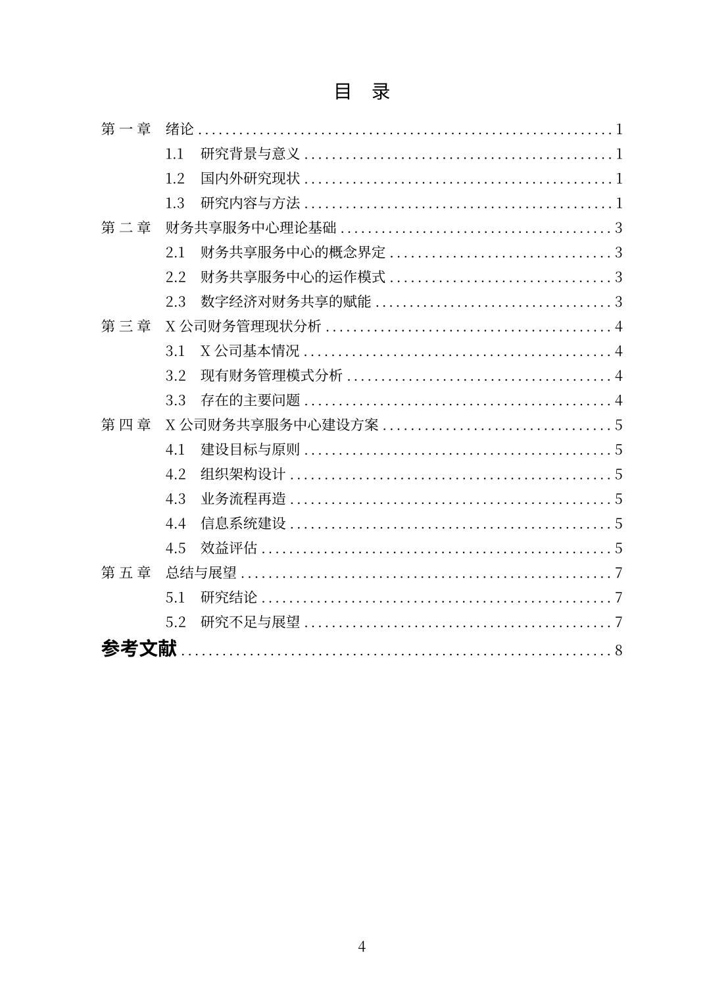
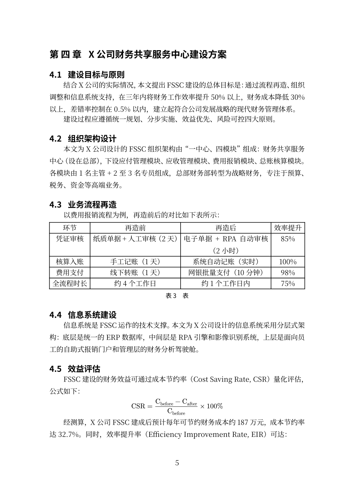
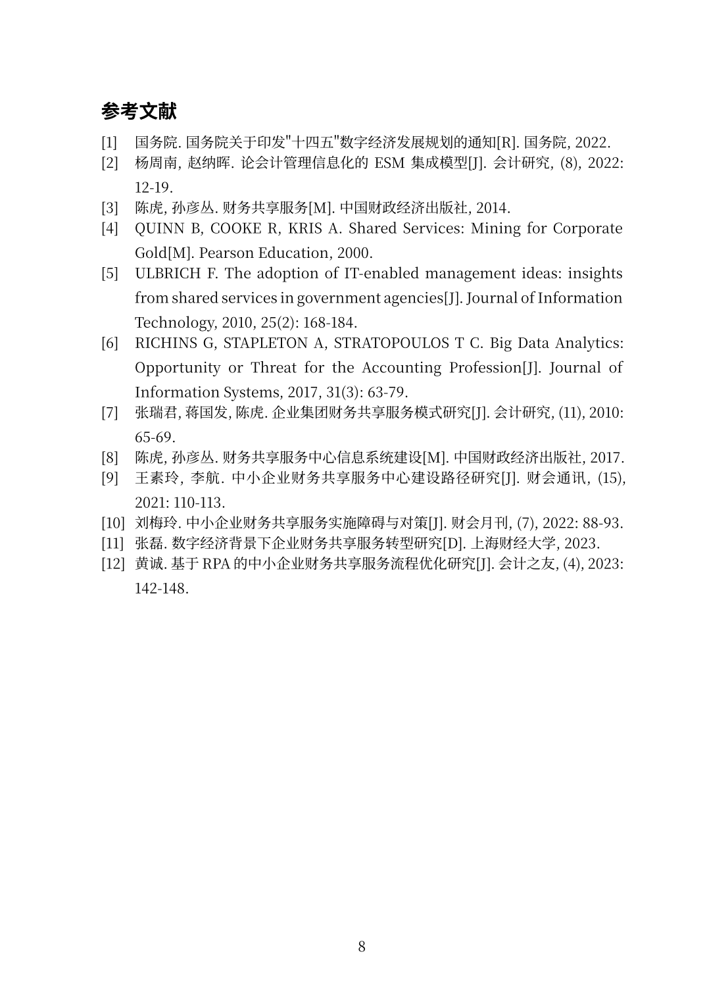

# 论文格式助手 · Thesis Format Assistant

> 本科毕业论文一键格式化工具：上传 `.docx` → 格式体检 → 自动排版 → 导出符合 **GB/T 7714-2015** 的高质量 PDF

[](https://python.org)
[](https://typst.app)
[](LICENSE)

---

## 演示效果

会计学专业本科论文：**数字经济背景下中小企业财务共享服务中心建设研究**

| 封面 | 目录 | 正文（公式 + 表格）| 参考文献 |
|---|---|---|---|
|  |  |  |  |

---

## 核心特性

- **格式体检**：检测伪标题、首行缩进缺失、标题层级跳跃、字体混用等 6 类规则，给出评分和修复建议
- **一键排版**：docx → Typst 中间层 → PDF，编译速度 < 1 秒
- **参考文献自动化**：从知网粘贴的纯文本一键转换为 GB/T 7714-2015 格式，支持 `[J]` `[M]` `[D]` `[R]` `[C]` `[EB/OL]` 等所有类型
- **中括号引用**：docx 里写 `[1]`、`[2,3]`、`[1-3]`，PDF 里自动渲染为规范上标
- **Word 公式支持**：OMML（Word 公式编辑器）→ Typst 数学语法，行内 + 块级均支持
- **多校配置**：`templates/schools/*.yaml` 零代码切换学校规范（内置 generic / 南京大学 / 重庆城市科技学院）
- **交互原型**：单文件 HTML，双击即可在本地浏览器体验完整产品流程

---

## 快速开始

### 依赖安装

```bash
# Python 依赖
pip install python-docx pyyaml lxml flask pillow

# 系统依赖
# macOS
brew install pandoc typst
# Ubuntu/Debian
apt install pandoc fonts-noto-cjk
# typst: https://github.com/typst/typst/releases
```

### 一条命令跑通

```bash
python run.py examples/accounting_thesis.docx examples/accounting_meta.yaml \
              --school cqcst --out output/my-thesis
```

产物在 `output/my-thesis/`：
- `final.pdf` — 排版后的 PDF
- `lint.txt` — 格式体检报告
- `main.typ` — Typst 源码（可在 typst 编辑器继续修改）
- `references.yml` — 参考文献转换结果

### 使用 Web 界面（原型）

```bash
# 方式 A：双击直接打开（演示模式，数据内置）
open prototype/index.html

# 方式 B：接入真实后端（通电模式）
pip install flask
python prototype/server.py
# 浏览器打开 http://127.0.0.1:5000/
```

---

## 项目结构

```
thesis-helper/
├── run.py                      ← CLI 入口（一条命令跑通）
│
├── parser/                     ← 引擎层
│   ├── docx_to_ir.py           ← docx → 语义 IR JSON（含 OMML 公式提取）
│   ├── ir_to_typst.py          ← IR → Typst 源码
│   ├── gbt7714_parser.py       ← 知网文本 → hayagriva YAML
│   └── lint.py                 ← 格式体检（6 类规则）
│
├── templates/                  ← 模板层
│   ├── core.typ                ← 参数化 Typst 核心模板
│   └── schools/
│       ├── generic.yaml        ← 通用本科范本（完整参数）
│       ├── nju.yaml            ← 南京大学
│       └── cqcst.yaml          ← 重庆城市科技学院（placeholder）
│
├── prototype/                  ← 产品交互原型
│   ├── index.template.html     ← SPA 原型模板（含所有 JS/CSS）
│   ├── build.py                ← 构建脚本，生成 index.html
│   ├── server.py               ← Flask 后端，接入真实流水线
│   └── assets/                 ← 演示用资产（PDF 预览图）
│
└── examples/                   ← 示例文件
    ├── accounting_thesis.docx  ← 会计学论文（完整演示样本）
    ├── accounting_meta.yaml    ← 元信息配置
    ├── cnki_refs_accounting.txt← 知网格式参考文献
    └── make_accounting_thesis.py ← 样本 docx 构造脚本
```

---

## 参考文献支持

三种来源，工具自动识别：

```yaml
# accounting_meta.yaml

# 方式 1：知网粘贴文本（最常用）
bibliography_text_path: cnki_refs_accounting.txt

# 方式 2：BibTeX
# bibliography_path: references.bib

# 方式 3：Hayagriva YAML（工具内部格式）
# bibliography_path: references.yml
```

知网格式示例（`cnki_refs.txt`）：
```
[1] 陈虎, 孙彦丛. 财务共享服务[M]. 北京: 中国财政经济出版社, 2014.
[2] 张瑞君, 蒋国发, 陈虎. 企业集团财务共享服务模式研究[J]. 会计研究, 2010, (11): 65-69.
[3] 国务院.国务院关于印发"十四五"数字经济发展规划的通知[R]. 北京: 国务院, 2022.
```

---

## 新增学校规范

复制 `templates/schools/generic.yaml`，修改关键参数：

```yaml
school_id: your_school
school_name: "XX大学"
sizes:
  body: "小四"     # 正文字号
  h1:   "三号"     # 一级标题（章标题）
  h2:   "四号"     # 二级标题
paragraph:
  leading: "1em"   # 行距
  first_indent: "2em"
bibliography:
  style: "gb-7714-2015-numeric"
```

yaml 配置好后直接使用：
```bash
python run.py thesis.docx meta.yaml --school your_school
```

---

## 路线图

- [x] docx → PDF 完整闭环
- [x] 知网参考文献一键转换（12 种类型代码）
- [x] Word 公式编辑器（OMML）支持
- [x] 产品交互原型（SPA + Flask 后端）
- [x] 多校 yaml 配置架构
- [ ] 重庆城市科技学院规范真实化（`cqcst.yaml` 目前 placeholder）
- [ ] Web UI 元信息表单（作者/导师/日期等）
- [ ] 公式编号 + 交叉引用
- [ ] 图/表 caption 自动提取

---

## License

MIT
